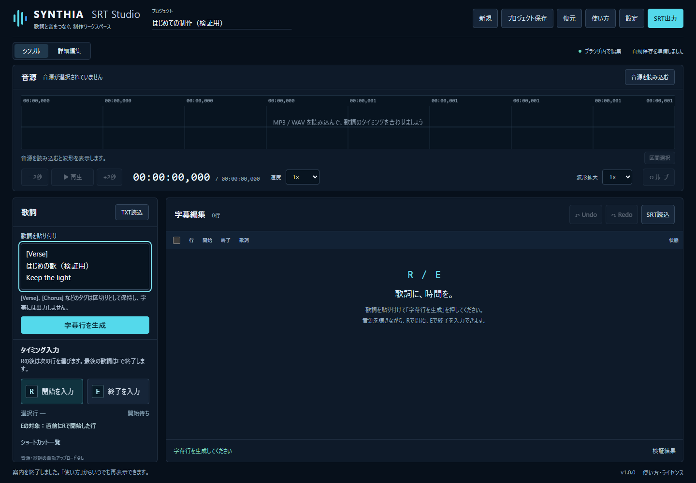
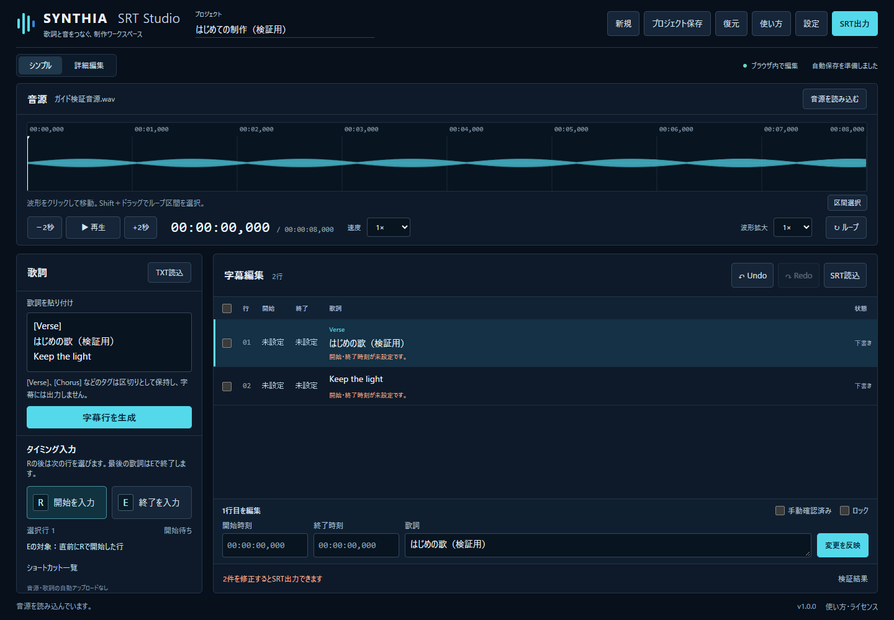
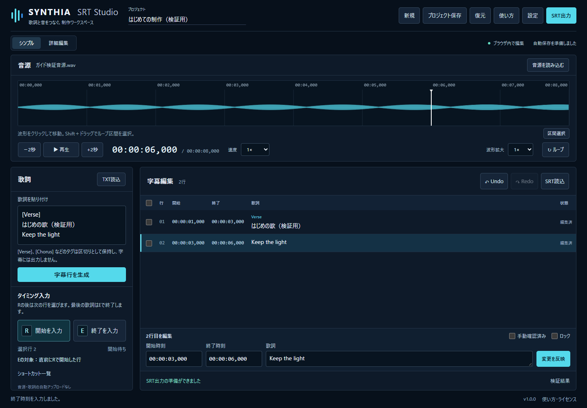
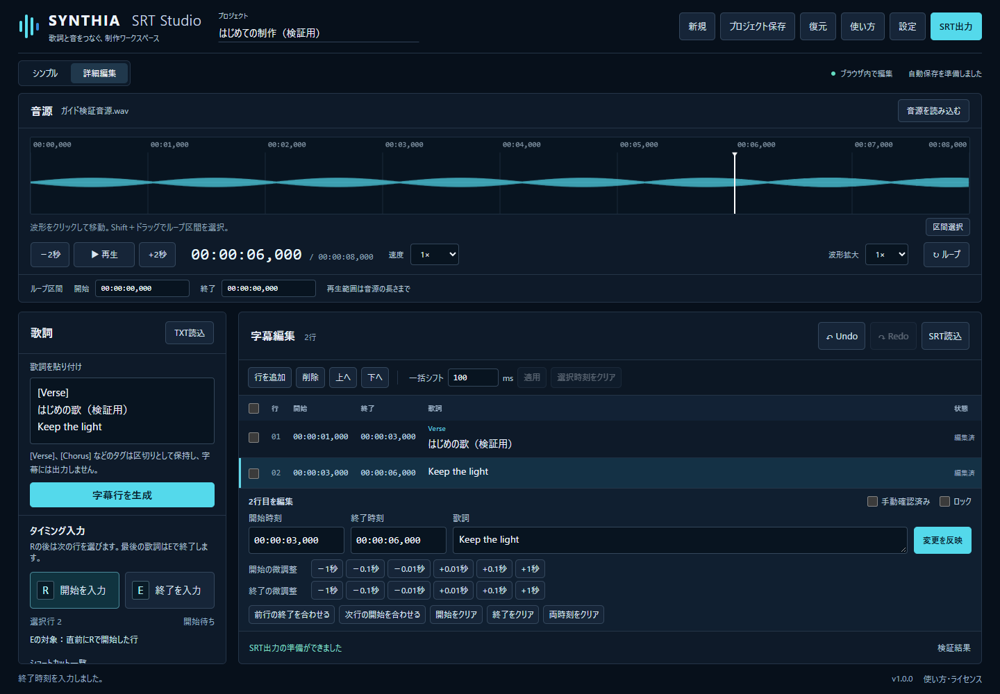
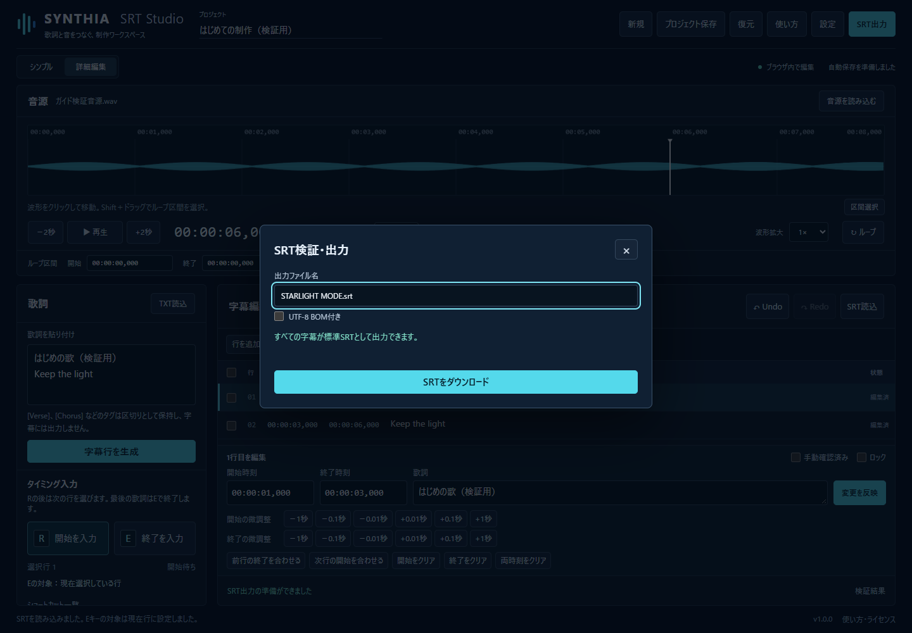

# SYNTHIA SRT Studio 最短操作ガイド

v1.0 / 2026-10-09

用意するもの：MP3またはWAVの音楽ファイル、コピーできる歌詞。

ヘッダーの「使い方」から、5段階のはじめてガイドを再表示できます。説明を閉じてから、次の操作を行います。

## 1. 歌詞を入力する

歌詞を1行ずつ貼り付け、「字幕行を生成」を押すと一覧になります。

スマホでは「歌詞入力」で入力欄を表示します。

歌詞を貼り付けた実画面。「字幕行を生成」で一覧へ反映します。

## 2. 音源を読み込む

「音源を読み込む」でMP3やWAVを選び、「▶ 再生」で音楽を確認します。

音源はこのブラウザで読み込みます。自動で外部へ送信されません。

生成した8秒の検証用WAVを読み込んだ実画面。実際の楽曲ではありません。

## 3. R/Eキーで時間をつける

歌い出しでR。次の歌詞でRを押すと、前の歌詞が自動で終了します。最後の歌詞はEで終了してください。

間に無音を空けたいときは、その前にE。Rを押すと選択は次の行へ進みます。入力欄から外れて操作してください。

R/Eで時刻をつけた実画面。開始・終了の両方が必要です。

## 4. タイミングを修正する

一覧の歌詞を選び、開始・終了時刻を直して「変更を反映」を押します。

一覧が空のときは、先に歌詞から字幕行を生成します。細かい調整は「詳細編集」で行えます。

詳細編集の実画面。±0.1秒などのボタンで微調整できます。

## 5. SRTを書き出す

ヘッダーの「SRT出力」で問題のある行を確認し、「SRTをダウンロード」で保存します。

途中でやめるときは「プロジェクト保存」。音源本体は保存されないので、元の音源も残してください。

SRT検証・出力の実画面。時刻を確認してファイル名を指定します。

詳しい操作は [完全マニュアル](USER_GUIDE.md)、困ったときは [FAQ](FAQ.md) を確認してください。

---

説明の更新元は `src/help/content.json` です。アプリ内ヘルプとこの説明は同じデータから作ります。UI・機能・キーを変更した場合は説明も更新し、実画面を撮り直して `npm run docs:generate` と `npm run docs:check` を実行してください。
