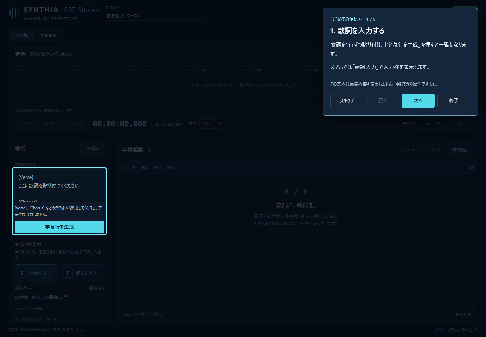
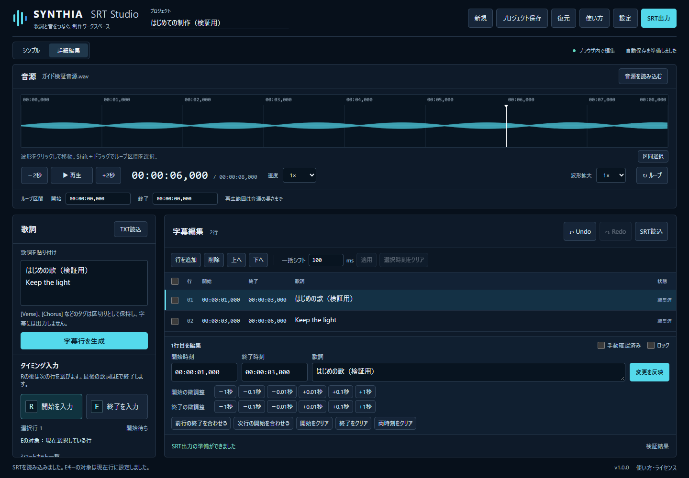

# SYNTHIA SRT Studio 初心者向け完全マニュアル

v1.0 / 2026-10-09

歌詞に時間をつけて、SRTファイルを作ろう！SRTは、歌詞と表示する時間をまとめた字幕ファイルです。音楽ファイルと歌詞があれば、基本操作を始められます。

[アプリを開く](https://synthia-creative.github.io/synthia-srt-studio/) · [最短操作ガイド](QUICK_START.md) · [ショートカット](SHORTCUTS.md) · [よくある質問](FAQ.md)

画面写真は完成したアプリを操作して撮影しています。画像内の音源・歌詞は動作確認用で、実際の楽曲や作品ではありません。

## はじめての使い方

用意するものは、MP3またはWAVの音楽ファイルと、コピーできる歌詞の2つです。音源・歌詞の権利を確認し、自分が使用できるものを用意してください。

ヘッダーの「使い方」からこの説明をいつでも開けます。「はじめてガイドを開始」で5つの操作箇所を確認できます。ガイドは説明のみで、字幕や時刻を変更しません。

初回はガイドを案内します。「次へ」「戻る」で順番に確認し、「スキップ」や「終了」、Escで途中でも閉じられます。ヘルプやガイドを開いている間は、R/Eなどの制作キーは働きません。閉じれば元の作業を続けられます。

1. 歌詞を貼り付けて「字幕行を生成」。
2. 「音源を読み込む」で音楽を選ぶ。
3. 再生しながら歌い出しでR、最後の歌い終わりでE。
4. ずれた時刻を直して「変更を反映」。
5. 「SRT出力」→「SRTをダウンロード」。

実際の初回ガイド。明るい枠が操作箇所です。説明を閉じてから編集を始めます。

## 歌詞の入力方法

1行を1つの字幕として扱います。日本語・英語・両方が混ざった歌詞を入力できます。同じ歌詞の繰り返しや、行内の空白も保持します。

[Verse]、[Chorus]などの区切りは見出しとして整理し、SRTの本文には入れません。[Intro]、[Verse 1]、[Pre-Chorus]、[Bridge]、[Outro]、[Instrumental]も認識します。

画面が狭いときは「歌詞入力」で入力欄を表示します。既に字幕がある状態で「字幕行を生成」を押すと置き換え確認が出ます。必要なら先にプロジェクトを保存してください。

1. 「歌詞を貼り付け」に歌詞を貼り付ける。または「TXT読込」でテキストファイルを選ぶ。
2. 歌詞が1行ずつ分かれているか確認する。
3. 「字幕行を生成」を押す。字幕編集の一覧に行ができたことを確認する。

歌詞を貼り付けた実画面。「字幕行を生成」で一覧へ反映します。

## 音源の読み込み

「音源を読み込む」でパソコンや端末に保存したMP3・WAVを選びます。曲名を示す欄には、選んだファイルの名前が表示されます。

波形は音の大きさを示す模様です。波形をクリックすると、その位置へ移動します。再生・停止、−2秒／+2秒、速度0.5〜1.5倍、波形拡大1〜16倍を使えます。

同じ部分を繰り返すには「区間選択」を押して波形をドラッグするか、Shiftを押しながらドラッグします。「↻ ループ」で繰り返しを切り替えます。詳細編集ではループの開始・終了を時刻で指定できます。

波形の解析に失敗しても、再生できれば字幕制作を続けられます。64MiBまたは10分を超える音源では、負荷を抑えるため波形を作りません。再生できる形式はブラウザによって異なります。

1. 「音源を読み込む」を押して音楽ファイルを選ぶ。
2. ファイル名と曲の長さが出るまで待つ。
3. 「▶ 再生」を押す。時間表示が進み、音が流れるか確認する。停止は「Ⅱ 停止」。

生成した8秒の検証用WAVを読み込んだ実画面。実際の楽曲ではありません。

## R/Eキーの操作

最初の設定は「連続字幕」です。Rは、今選んでいる行の開始を入れて、次の行を選びます。Eは、直前にRで開始した行を終了します。選択行と、Eで終了する行が違う場合がある点を覚えてください。

続けて歌う部分では、次の歌い出しでRを押すと、前の行の終了が自動で入ります。既に入っている終了時刻は残します。間に無音を空けるときは、前の歌い終わりでEを押してから、次のRを押します。最後の行は必ずEで終了してください。

設定で「個別終了」を選ぶと、自動終了は行わず、各行をEで終了します。「Eキーの対象」を「現在選択している行」にした場合は、選択中の行を終了し、次の行へ進みます。SRT読込後はこの対象へ切り替わります。

キーを使う前に歌詞の入力欄から外れます。欄外の見出しをクリックすると確実です。入力欄やヘルプを開いたままのキー入力は、誤操作防止のため字幕には反映しません。R/Eの画面ボタンでも同じ操作ができます。

1. 最初の字幕行を選び、音楽を最初から再生する。
2. 1行目の歌い出しでRを押す。選択は2行目へ進む。
3. 2行目の歌い出しでRを押す。連続字幕では1行目の終了も入る。
4. 最後の行の歌い終わりでEを押す。各行の開始と終了を確認する。

R/Eで時刻をつけた実画面。開始・終了の両方が必要です。

## タイミング修正

一覧の歌詞や行番号を選ぶと、その行の編集欄が表示されます。歌詞や行番号を押すと、開始時刻まで音源も移動します。時刻を押した場合は、行だけを選びます。

開始・終了の欄は、たとえば1.5秒なら 00:00:01,500 と入力します。カンマの後の3桁は、1秒を1000に分けた数です。歌詞も直し、最後に「変更を反映」を押してください。欄を空にすると、その時刻は未設定になります。

「詳細編集」では開始・終了を±0.01秒、±0.1秒、±1秒で調整できます。「前行の終了を合わせる」は前の行の終了を、選択行の開始へ合わせます。「次行の開始を合わせる」は次の行の開始を、選択行の終了へ合わせます。

複数行の左端にチェックを付け、一括シフト量を入れて「適用」すると、選択した行をまとめて移動します。100msは0.1秒です。0秒より前へは移動せず、行の長さ・間隔を保つ共通の移動量へ調整します。

詳細編集で行の追加・削除・上下移動、時刻のクリアもできます。削除やクリアには確認が出ます。「手動確認済み」は確認の記録。「ロック」は時刻・歌詞・削除などを防ぎ、変更するには解除が必要です。

「Undo」またはCtrl＋Zで直前の字幕編集を戻せます。「Redo」でやり直せます。最大100回の字幕編集を扱います。選択・再生位置・表示設定だけの変更はUndoの対象ではありません。

1. 修正したい行を選ぶ。
2. 開始・終了時刻や歌詞を直す。細かな調整は「詳細編集」で行う。
3. 「変更を反映」を押す。
4. もう一度音楽を再生し、字幕の時間を確認する。

詳細編集の実画面。±0.1秒などのボタンで微調整できます。

## 既存SRTの修正

SRTは作り直さずに読み込んで修正できます。未完成のSRTも読み込めますが、時刻がない行を完成させるまで出力できません。

画面が狭いときは「字幕編集」を押して「SRT読込」を表示します。読込後のEキーは、現在選択中の行を終了する設定になります。最初の設定と対象が違うので、必要に応じて「設定」で確認してください。

SRT本文の読み込みはUTF-8を標準とし、読み込めない場合はShift-JISも試します。SRTではないファイルや不正なプロジェクトを選ぶと、理由を表示し、現在のデータを保持します。

1. 字幕編集の「SRT読込」でSRTファイルを選ぶ。既存の字幕がある場合は置き換えを確認する。
2. 同じ曲の音源を読み込む。
3. 修正したい行を選び、時刻や本文を直して「変更を反映」。
4. 「SRT出力」から修正版をダウンロードする。

既存SRTを読み込んだ実画面。Eキーの対象は現在選択中の行へ切り替わります。

## ファイル保存

SRT出力は、完成した字幕を対応する動画編集アプリなどへ渡すための保存です。プロジェクト保存は、途中の作業を後日再開するための保存です。両方を必要に応じて使ってください。

「SRT出力」では問題のある行が表示されます。開始・終了が未設定、終了が開始より前または同時、歌詞が空、歌詞の中に空の行がある場合は出力できません。問題の項目を押すと該当行へ移動します。直してから再度出力してください。

時間の重なり・開始順の警告は確認後に出力できます。ファイル名は自分で決められます。必要な場合だけ「UTF-8 BOM付き」を選びます。保存先はブラウザのダウンロード設定に従います。

「プロジェクト保存」は、曲名.synthia-srt.json を保存します。字幕・歌詞原文・区切り・確認とロック・設定・選択行・保存位置・音源名が含まれます。音源本体とUndoの履歴は含まれません。音源も元の場所に残してください。

次回は「復元」でプロジェクトファイルを選び、同じ音源を再選択します。同じファイル名なら保存位置へ戻り、異なる音源なら先頭から始まります。

自動下書きは、このブラウザに保存される補助機能です。起動時に見つかると復元を選べます。他のブラウザや端末へ共有されず、ブラウザのデータを消すと下書きも消えます。大切な作業はプロジェクト保存でも残してください。

1. 完成したらヘッダーの「SRT出力」を押す。
2. 問題がある行は修正し、出力できる状態にする。
3. 出力ファイル名を決める。例：STARLIGHT MODE.srt。
4. 「SRTをダウンロード」を押し、ダウンロード先を確認する。
5. 途中でやめるときは「プロジェクト保存」も押し、JSONと音源の保存場所を覚えておく。

SRT検証・出力の実画面。時刻を確認してファイル名を指定します。

## ショートカット一覧

ヘルプ・ガイド・設定・確認画面が開いている間、入力欄を編集している間、日本語変換中、キー長押し中は、制作ショートカットを無効にします。

MacではCtrlの代わりに⌘も使えます。ボタンにフォーカスがあるときのSpaceは、そのボタンを押す操作です。タップ補助モードではSpaceが開始入力になります。再生・停止はプレイヤーのボタンを使います。

設定のタップ入力オフセットは入力時刻に加える補正です。100ms遅れて押してしまう場合は−100を指定します。WはそれにWキーの追加補正も加えます。最初のW追加補正は−100ms（0.1秒早める）です。

| キー | できること |
| --- | --- |
| R | 選択行に開始時間を入れ、次の行を選ぶ。連続字幕では前の入力中行を自動で終了する。 |
| E | 設定の対象行に終了時間を入れる。初期設定は直前にRで開始した行。最後の行にも必要。 |
| W | Rの操作に、設定したW用の時間補正を加える。 |
| Shift＋R | 選択行の開始と、1つ前の行の終了を同じ時間へ直し、次の行を選ぶ。 |
| Shift＋W | Shift＋Rの操作にW用の補正を加える。 |
| Shift＋E | Eの対象を一度だけ反対へ切り替える（直前にRで開始した行／選択行）。 |
| Z / Ctrl＋Z | 直前の字幕編集を取り消す。 |
| Ctrl＋Y / Ctrl＋Shift＋Z | 取り消した字幕編集をやり直す。 |
| ↑ / ↓ | 選択する字幕を前／次の行へ移す。 |
| ← / → | 音楽の位置を2秒戻す／進める。 |
| Shift＋← / → | 選択行の開始を0.1秒早める／遅らせる。 |
| Space | 音楽を再生／停止する。タップ補助モードでは開始時間を入れる。 |
| Tab / Shift＋Tab / Enter | ボタンや入力欄へ進む／戻る。Enterで選んだボタンを押す。 |
| Esc | 開いているヘルプ・ガイド・確認画面を閉じる。ガイドを途中で閉じることもできる。 |

## よくある質問

よくある質問を選ぶと回答が開きます。操作できないときは「トラブル対処」も確認してください。

### SRTとは何ですか？

歌詞と、その歌詞を表示する開始・終了時間をまとめた字幕ファイルです。対応する動画編集アプリなどで利用できます。

### Rを押したら次の歌詞が選ばれました。間違いですか？

正常な動作です。Rは開始を入れたあと、次の行を選びます。初期設定のEは、次の選択行ではなく直前にRで開始した行を終了します。

### 最後の歌詞だけSRT出力できません。

最後の行は次のRがないため、自動終了しません。歌い終わりでEを押すか、終了時刻を直接入力して「変更を反映」を押してください。

### 音楽が再生されません。

MP3またはWAVを選び、曲の長さが出るまで待って再生を押してください。音量・端末のミュートも確認します。ブラウザで対応しない形式は、対応する形式へ変換してから試してください。

### Rキーが反応しません。

字幕行と音源が必要です。入力欄、日本語変換、ヘルプやガイドを閉じ、画面の見出しなどをクリックしてからRを押してください。ロックも確認します。

### 間違えたタイミングは直せますか？

Ctrl＋ZやUndoで取り消すか、行を選んで開始・終了時刻を修正します。細かな調整は詳細編集の±0.1秒などを使います。

### 途中で終了しても大丈夫ですか？

先に「プロジェクト保存」を押してJSONを残し、音源も保存しておきます。次回「復元」でJSONを選び、音源を読み込み直してください。

### ヘルプやガイドを開くと歌詞が消えますか？

消えません。入力中の歌詞、字幕、時刻、編集欄の未反映の入力も保持します。ガイドは操作箇所を案内するだけです。

### 音楽や歌詞は外部へ送信されますか？

アプリの編集処理はブラウザ内で行います。音源・歌詞の自動アップロードやAIへの送信はありません。ヘルプも同じ公開サイトに用意しています。

### スマホでも使えますか？

歌詞入力と字幕編集を切り替え、画面のR/Eボタンでも時間を入力できます。物理キーのショートカットにはキーボードが必要です。端末の対応形式や音源の選び方は機種により異なります。

### はじめてガイドはもう一度見られますか？

ヘッダーの「使い方」→「はじめての使い方」→「はじめてガイドを開始」で何度でも開けます。ブラウザ保存が使えない場合は、再訪時にも初回案内が出ることがあります。

## トラブル対処

困ったときは、まず画面下のメッセージと、SRT出力の問題一覧を確認します。音源や歌詞を消す前に「プロジェクト保存」で作業を残してください。

### SRTのダウンロードボタンが押せない

問題一覧の行を選び、開始・終了・歌詞を確認します。終了は開始より後にしてください。未設定、空本文、本文内の空の行も修正します。最後の行はEで終了します。

### 開始時刻を直すとエラーになる

開始が既存の終了と同じ、または後になっていませんか。終了も後ろへ直してから反映します。アプリは既存終了を勝手に消さず、元の時間を保持します。

### 波形が表示されない

波形解析に対応しない音源や、64MiB／10分を超える音源では波形が出ないことがあります。再生できれば時間入力と字幕編集は続けられます。

### JSONを復元したのに音楽がない

JSONに音源本体は入りません。「音源を読み込む」で元の音源を選び直します。同じファイル名なら保存していた再生位置へ戻ります。

### 保存したSRTやJSONが見つからない

ブラウザのダウンロード履歴か、端末のダウンロードフォルダを確認します。保存先を選ぶ設定の場合は、選んだフォルダを確認してください。

### 自動下書きが残らない

ブラウザの保存設定、空き容量、プライベート閲覧を確認します。自動下書きは端末間で共有されません。確実に作業を残すには「プロジェクト保存」を使ってください。

### 行を変更・削除できない

「ロック」にチェックがある場合は外します。「変更を反映」を忘れていないか、確認画面で操作を確定したかも確認してください。

### Spaceが再生ではなく開始入力になる

設定でタップ補助モードが有効になっています。解除するか、プレイヤーの再生・停止ボタンを使ってください。

---

説明の更新元は `src/help/content.json` です。アプリ内ヘルプとこの説明は同じデータから作ります。UI・機能・キーを変更した場合は説明も更新し、実画面を撮り直して `npm run docs:generate` と `npm run docs:check` を実行してください。
